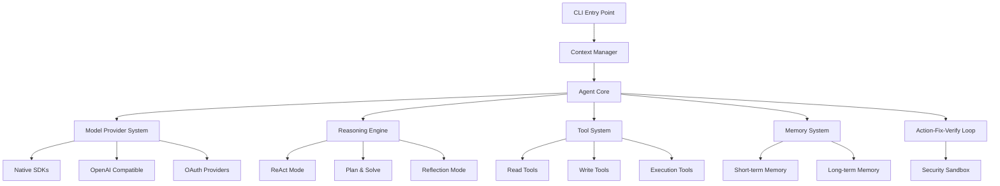

# Cogent AI Coding Agent - V1 Specification

**Date:** 2025-12-29  
**Version:** 1.0  
**Language:** TypeScript/Node.js

## Overview

This specification defines the first version of **Cogent**, an AI-powered coding agent designed to assist developers with intelligent code understanding, editing, and verification. The design is inspired by proven architectures like [neovate-code](../neovate-code) while incorporating advanced reasoning patterns (ReAct, Plan-and-Solve, Reflection) and comprehensive memory systems.

## Core Architecture

### System Components



### Technology Stack

- **Runtime**: Node.js 18+ with TypeScript 5.0+
- **Package Manager**: pnpm
- **CLI Framework**: Commander.js or oclif
- **LLM Integration**: AI SDK (Vercel AI SDK) for multi-provider support
- **Vector DB**: LanceDB or ChromaDB
- **Code Analysis**: Tree-sitter
- **Terminal UI**: Ink (React for CLIs)
- **Testing**: Vitest
- **Code Quality**: Biome
- **Schema Validation**: Zod

## Multi-Provider Support

### Architecture Overview

**Multi-Layered Factory Pattern**:

- Each provider defines a `createModel()` factory method
- Providers use different strategies: native SDKs (OpenAI, Anthropic), OpenAI-compatible APIs (DeepSeek, Moonshot), or OAuth (GitHub Copilot)
- Default factory handles 15+ providers through OpenAI-compatible endpoints

**Key Design Patterns**:

- **Strategy Pattern**: Different provider implementations plugged in as needed
- **Plugin System**: Extends providers without code changes
- **Lazy Initialization**: Models created on-demand, not upfront
- **Configuration Hierarchy**: Environment variables → User config → Built-in defaults

### Provider Categories

**1. Major API Providers**

- OpenAI (GPT-4, GPT-3.5)
- Anthropic (Claude 3.5 Sonnet, Claude 3 Opus)
- Google (Gemini Pro, Gemini Flash)
- xAI (Grok)
- DeepSeek (DeepSeek-V3, DeepSeek-Coder)

**2. Aggregators** (50+ models combined)

- OpenRouter
- AIHubMix
- ZenMux
- iFlow

**3. Specialized**

- GitHub Copilot (OAuth authentication)
- HuggingFace
- Groq
- Cerebras

**4. Regional** (China-focused)

- Moonshot/Kimi
- Zhipu AI
- ModelScope
- SiliconFlow
- VolcEngine

### Provider System Implementation

```typescript
// src/model/types.ts

export interface ModelInfo {
  provider: ProviderInfo
  model: ModelDetails
  _mCreator: () => Promise<LanguageModel>
}

export interface ProviderInfo {
  id: string
  name: string
  apiKeyEnvVar?: string
  baseURL?: string
}

export interface ModelDetails {
  id: string
  name: string
  contextWindow: number
  maxOutputTokens: number
  supportsFunctionCalling: boolean
  supportsStreaming: boolean
  supportsVision: boolean
}

export interface Provider {
  id: string
  name: string
  apiKeyEnvVar?: string
  baseURL?: string
  models: string[]
  createModel: (modelId: string, config: ModelConfig) => Promise<LanguageModel>
}

export interface ModelConfig {
  apiKey?: string
  baseURL?: string
  temperature?: number
  maxTokens?: number
  [key: string]: any
}

// src/model/provider-manager.ts

export interface IProviderManager {
  registerProvider(provider: Provider): void
  getProvider(providerId: string): Provider | undefined
  getAllProviders(): Provider[]
  resolveModel(modelString: string, config: ModelConfig): Promise<ModelInfo>
}

export class ProviderManager implements IProviderManager {
  private providers: Map<string, Provider>
  private pluginProviders: Map<string, Provider>

  constructor()
  registerProvider(provider: Provider): void
  getProvider(providerId: string): Provider | undefined
  getAllProviders(): Provider[]
  resolveModel(modelString: string, config: ModelConfig): Promise<ModelInfo>
  private parseModelString(modelString: string): {
    providerId: string
    modelId: string
  }
}

// src/model/providers/base.ts

export abstract class BaseProvider implements Provider {
  abstract id: string
  abstract name: string
  abstract apiKeyEnvVar?: string
  abstract baseURL?: string
  abstract models: string[]

  abstract createModel(
    modelId: string,
    config: ModelConfig
  ): Promise<LanguageModel>

  protected getApiKey(config: ModelConfig): string
  protected validateConfig(config: ModelConfig): void
}

// src/model/providers/openai.ts

export class OpenAIProvider extends BaseProvider {
  id: string
  name: string
  apiKeyEnvVar: string
  baseURL: string
  models: string[]

  createModel(modelId: string, config: ModelConfig): Promise<LanguageModel>
}

// src/model/providers/anthropic.ts

export class AnthropicProvider extends BaseProvider {
  id: string
  name: string
  apiKeyEnvVar: string
  models: string[]

  createModel(modelId: string, config: ModelConfig): Promise<LanguageModel>
}

// src/model/providers/google.ts

export class GoogleProvider extends BaseProvider {
  id: string
  name: string
  apiKeyEnvVar: string
  models: string[]

  createModel(modelId: string, config: ModelConfig): Promise<LanguageModel>
}

// src/model/providers/openai-compatible.ts

export class OpenAICompatibleProvider extends BaseProvider {
  constructor(
    id: string,
    name: string,
    baseURL: string,
    apiKeyEnvVar: string,
    models: string[]
  )

  createModel(modelId: string, config: ModelConfig): Promise<LanguageModel>
}

// src/model/providers/github-copilot.ts

export interface GitHubCopilotAuth {
  getToken(): Promise<string>
  refreshToken(): Promise<string>
}

export class GitHubCopilotProvider extends BaseProvider {
  id: string
  name: string
  models: string[]

  constructor(auth: GitHubCopilotAuth)
  createModel(modelId: string, config: ModelConfig): Promise<LanguageModel>
}

// src/model/providers/registry.ts

export const BUILTIN_PROVIDERS: Record<string, Provider>

export function createDefaultProviders(): Provider[]
```

### Provider Configuration

```typescript
// src/config.ts

export interface ProviderConfig {
  apiKey?: string
  baseURL?: string
  models?: string[]
  [key: string]: any
}

export interface Config {
  model: string
  planModel?: string
  smallModel?: string
  visionModel?: string

  providers?: Record<string, ProviderConfig>

  // ... other config fields
}

// Example configuration
const config: Config = {
  model: 'anthropic/claude-3-5-sonnet-20241022',
  smallModel: 'openai/gpt-4o-mini',
  planModel: 'anthropic/claude-3-5-sonnet-20241022',

  providers: {
    openai: {
      apiKey: process.env.OPENAI_API_KEY,
    },
    anthropic: {
      apiKey: process.env.ANTHROPIC_API_KEY,
    },
    deepseek: {
      apiKey: process.env.DEEPSEEK_API_KEY,
      baseURL: 'https://api.deepseek.com/v1',
    },
    openrouter: {
      apiKey: process.env.OPENROUTER_API_KEY,
      baseURL: 'https://openrouter.ai/api/v1',
    },
  },
}
```

## Feature Specifications

### 1. Code Context Awareness

```typescript
// src/tools/read.ts

export interface ReadFileParams {
  file_path: string
  offset?: number
  limit?: number
}

export interface ReadFileResult {
  content: string
  totalLines: number
  actualLinesRead: number
  filePath: string
}

export function createReadTool(opts: { cwd: string; productName: string }): Tool

// src/tools/ls.ts

export interface ListDirParams {
  path: string
  recursive?: boolean
  max_depth?: number
}

export interface ListDirResult {
  files: FileInfo[]
  directories: DirectoryInfo[]
}

export function createLSTool(opts: { cwd: string }): Tool

// src/tools/glob.ts

export interface GlobSearchParams {
  pattern: string
  cwd?: string
}

export interface GlobSearchResult {
  files: string[]
  count: number
}

export function createGlobTool(opts: { cwd: string }): Tool

// src/tools/grep.ts

export interface GrepSearchParams {
  pattern: string
  path?: string
  regex?: boolean
  context_before?: number
  context_after?: number
}

export interface GrepSearchResult {
  matches: GrepMatch[]
  totalMatches: number
}

export function createGrepTool(opts: { cwd: string }): Tool
```

### 2. Token Budget System

```typescript
// src/utils/token-counter.ts

export interface ITokenCounter {
  count(text: string): number
  canAdd(text: string): boolean
  addContent(content: string, priority: number): boolean
  reset(): void
  getCurrentUsage(): number
}

export class TokenCounter implements ITokenCounter {
  constructor(model: string, maxTokens: number)
  count(text: string): number
  canAdd(text: string): boolean
  addContent(content: string, priority: number): boolean
  reset(): void
  getCurrentUsage(): number
  private evictLowPriorityContent(tokensNeeded: number): void
}

// src/context.ts

export enum ContextPriority {
  CRITICAL = 100,
  HIGH = 80,
  MEDIUM = 60,
  LOW = 40,
  VERY_LOW = 20,
}

export interface ContextItem {
  content: string
  priority: ContextPriority
  timestamp: Date
  tokens: number
}

export class ContextManager {
  constructor(maxTokens: number)
  addItem(content: string, priority: ContextPriority): boolean
  getContext(): string
  compress(): Promise<void>
  clear(): void
}
```

### 3. LLM Reasoning and Planning

```typescript
// src/reasoning/types.ts

export enum ReasoningMode {
  REACT = 'react',
  PLAN_SOLVE = 'plan_solve',
  REFLECTION = 'reflection',
}

export interface ReasoningResult {
  mode: ReasoningMode
  finalAnswer: string
  steps: ReasoningStep[]
  metadata: {
    turnsCount: number
    toolCallsCount: number
    duration: number
  }
}

export interface ReasoningStep {
  thought?: string
  action?: string
  observation?: string
  timestamp: Date
}

// src/reasoning/react.ts

export interface IReActAgent {
  run(task: string): Promise<string>
  getHistory(): ReasoningStep[]
}

export class ReActAgent implements IReActAgent {
  constructor(llm: LanguageModel, tools: Tools, maxSteps?: number)
  run(task: string): Promise<string>
  getHistory(): ReasoningStep[]
  private buildPrompt(task: string): string
  private parseResponse(text: string): { thought: string; action: string }
  private parseAction(actionText: string): {
    toolName: string
    params: Record<string, any>
  }
}

// src/reasoning/plan-solve.ts

export interface Plan {
  steps: PlanStep[]
  dependencies: Map<string, string[]>
}

export interface PlanStep {
  id: string
  description: string
  status: 'pending' | 'in_progress' | 'completed' | 'failed'
  result?: any
}

export interface IPlanAndSolveAgent {
  run(task: string): Promise<string>
  getPlan(): Plan | null
}

export class PlanAndSolveAgent implements IPlanAndSolveAgent {
  constructor(llm: LanguageModel, tools: Tools)
  run(task: string): Promise<string>
  getPlan(): Plan | null
  private generatePlan(task: string): Promise<Plan>
  private executeStep(step: PlanStep): Promise<any>
  private verifyStep(step: PlanStep): Promise<VerificationResult>
  private adjustPlan(
    plan: Plan,
    step: PlanStep,
    verification: VerificationResult
  ): Promise<void>
}

// src/reasoning/reflection.ts

export interface Reflection {
  iteration: number
  critique: string
  improvements: string[]
}

export interface ReflectionResult {
  solution: string
  reflections: Reflection[]
  finalSolution: string
}

export interface IReflectionAgent {
  run(task: string): Promise<ReflectionResult>
}

export class ReflectionAgent implements IReflectionAgent {
  constructor(llm: LanguageModel, tools: Tools, maxIterations?: number)
  run(task: string): Promise<ReflectionResult>
  private generateInitialSolution(task: string): Promise<string>
  private reflect(solution: string, task: string): Promise<Reflection>
  private regenerate(solution: string, reflection: Reflection): Promise<string>
}

// src/reasoning/mode-selector.ts

export interface IModeSelector {
  selectMode(task: string, userPreference?: ReasoningMode): ReasoningMode
}

export class ModeSelector implements IModeSelector {
  selectMode(task: string, userPreference?: ReasoningMode): ReasoningMode
  private isSimpleQuery(task: string): boolean
  private isMultiFileRefactoring(task: string): boolean
  private isCodeReview(task: string): boolean
}
```

### 4. Code Editing Capability

```typescript
// src/tools/write.ts

export interface WriteFileParams {
  file_path: string
  content: string
  create_backup?: boolean
}

export function createWriteTool(opts: { cwd: string }): Tool

// src/tools/edit.ts

export interface EditFileParams {
  file_path: string
  old_string: string
  new_string: string
  replace_all?: boolean
}

export function createEditTool(opts: { cwd: string }): Tool

// src/utils/backup.ts

export interface IBackupSystem {
  createBackup(filePath: string): Promise<string>
  restore(backupPath: string, targetPath: string): Promise<void>
  listBackups(filePath: string): Promise<string[]>
  cleanOldBackups(maxAge: number): Promise<void>
}

export class BackupSystem implements IBackupSystem {
  constructor(workspaceRoot: string)
  createBackup(filePath: string): Promise<string>
  restore(backupPath: string, targetPath: string): Promise<void>
  listBackups(filePath: string): Promise<string[]>
  cleanOldBackups(maxAge: number): Promise<void>
}

// src/utils/syntax-validator.ts

export interface ValidationResult {
  valid: boolean
  error?: string
  warnings?: string[]
}

export interface ISyntaxValidator {
  validate(content: string, filePath: string): Promise<ValidationResult>
}

export class SyntaxValidator implements ISyntaxValidator {
  validate(content: string, filePath: string): Promise<ValidationResult>
  private getLanguage(ext: string): any
}

// src/ui/diff.tsx

export interface DiffViewerProps {
  originalContent: string
  newContent: string
  filePath: string
}

export const DiffViewer: React.FC<DiffViewerProps>
```

### 5. Run and Verify Loop

```typescript
// src/tools/bash.ts

export interface CommandResult {
  stdout: string
  stderr: string
  exitCode: number
  duration: number
}

export interface BashToolParams {
  command: string
  timeout?: number
  capture_output?: boolean
}

export function createBashTool(opts: { cwd: string }): Tool
export function validateCommand(command: string): {
  safe: boolean
  reason?: string
}
export function isHighRiskCommand(command: string): boolean

// src/verification/strategies.ts

export interface Issue {
  type: 'error' | 'warning'
  message: string
  file?: string
  line?: number
}

export interface VerificationResult {
  passed: boolean
  issues: Issue[]
  summary: string
}

export interface IVerifier {
  verify(result: any): Promise<VerificationResult>
}

export class TestVerifier implements IVerifier {
  verify(testCommand: string): Promise<VerificationResult>
  private parseTestOutput(result: CommandResult): VerificationResult
}

export class LinterVerifier implements IVerifier {
  verify(files: string[]): Promise<VerificationResult>
  private parseLinterOutput(result: CommandResult): VerificationResult
}

export class TypeCheckVerifier implements IVerifier {
  verify(): Promise<VerificationResult>
  private parseTypeCheckOutput(result: CommandResult): VerificationResult
}

// src/loop/verification-loop.ts

export interface Task {
  description: string
  context: any
}

export interface LoopResult {
  success: boolean
  iterations: number
  result?: any
  error?: string
}

export interface IVerificationLoop {
  run(task: Task): Promise<LoopResult>
}

export class VerificationLoop implements IVerificationLoop {
  constructor(verifiers: IVerifier[], agent: IAgent, maxIterations?: number)
  run(task: Task): Promise<LoopResult>
  private verify(result: any): Promise<VerificationResult>
  private combineResults(results: VerificationResult[]): VerificationResult
  private generateFix(
    verification: VerificationResult,
    originalTask: Task
  ): Promise<Task>
}
```

### 6. Tool Call System

```typescript
// src/tool.ts

export type ApprovalCategory = 'read' | 'write' | 'command' | 'network'

export interface ToolApprovalInfo {
  category: ApprovalCategory
  needsApproval?: (context: ApprovalContext) => Promise<boolean> | boolean
}

export interface ApprovalContext {
  toolName: string
  params: Record<string, any>
  approvalMode: string
  context: any
}

export interface TextPart {
  type: 'text'
  text: string
}

export interface ImagePart {
  type: 'image'
  data: string
  mimeType: string
}

export interface ToolResult {
  llmContent: string | (TextPart | ImagePart)[]
  returnDisplay?: any
  isError?: boolean
  metadata?: Record<string, any>
}

export interface Tool<TSchema extends z.ZodTypeAny = z.ZodTypeAny> {
  name: string
  description: string
  displayName?: string
  parameters: TSchema
  execute: (
    params: z.output<TSchema>,
    toolCallId?: string
  ) => Promise<ToolResult> | ToolResult
  approval?: ToolApprovalInfo
  getDescription?: (opts: { params: z.output<TSchema>; cwd: string }) => string
}

export function createTool<TSchema extends z.ZodTypeAny>(config: {
  name: string
  displayName?: string
  description: string
  parameters: TSchema
  execute: (
    params: z.output<TSchema>,
    toolCallId?: string
  ) => Promise<ToolResult> | ToolResult
  approval?: ToolApprovalInfo
  getDescription?: (opts: { params: z.output<TSchema>; cwd: string }) => string
}): Tool<TSchema>

export interface ITools {
  get(toolName: string): Tool | undefined
  invoke(
    toolName: string,
    args: string,
    toolCallId: string
  ): Promise<ToolResult>
  toLanguageV2Tools(): LanguageModelV2FunctionTool[]
  length(): number
}

export class Tools implements ITools {
  constructor(tools: Tool[])
  get(toolName: string): Tool | undefined
  invoke(
    toolName: string,
    args: string,
    toolCallId: string
  ): Promise<ToolResult>
  toLanguageV2Tools(): LanguageModelV2FunctionTool[]
  length(): number
}

// src/message.ts

export type MessageRole = 'user' | 'assistant' | 'tool' | 'system'

export interface ToolUsePart {
  type: 'tool_use'
  id: string
  name: string
  input: Record<string, any>
  description?: string
  displayName?: string
}

export interface ToolResultPart {
  type: 'tool_result'
  toolCallId: string
  toolName: string
  input: Record<string, any>
  result: ToolResult
}

export type AssistantContent = (TextPart | ToolUsePart)[]
export type ToolContent = ToolResultPart[]

export interface NormalizedMessage {
  role: MessageRole
  content: string | AssistantContent | ToolContent
  timestamp: string
  uuid: string
  parentUuid: string | null
}
```

### 7. State and Memory

```typescript
// src/memory/short-term.ts

export interface IConversationHistory {
  addMessage(message: Omit<NormalizedMessage, 'uuid' | 'timestamp'>): void
  getRecent(n: number): NormalizedMessage[]
  compress(): Promise<void>
  clear(): void
}

export class ConversationHistory implements IConversationHistory {
  constructor(maxTurns?: number)
  addMessage(message: Omit<NormalizedMessage, 'uuid' | 'timestamp'>): void
  getRecent(n: number): NormalizedMessage[]
  compress(): Promise<void>
  clear(): void
  private compressOldMessages(): Promise<void>
  private summarizeMessages(
    messages: NormalizedMessage[]
  ): Promise<NormalizedMessage>
}

export interface ToolCall {
  toolName: string
  params: Record<string, any>
  result: any
  timestamp: Date
}

export interface IToolCallHistory {
  addCall(toolName: string, params: Record<string, any>, result: any): void
  getRecentCalls(n?: number): ToolCall[]
  clear(): void
}

export class ToolCallHistory implements IToolCallHistory {
  addCall(toolName: string, params: Record<string, any>, result: any): void
  getRecentCalls(n?: number): ToolCall[]
  clear(): void
}

export interface ReasoningStep {
  thought: string
  action: string
  observation: string
  timestamp: Date
}

export interface IReasoningTrace {
  addStep(thought: string, action: string, observation: string): void
  getSteps(): ReasoningStep[]
  clear(): void
}

export class ReasoningTrace implements IReasoningTrace {
  addStep(thought: string, action: string, observation: string): void
  getSteps(): ReasoningStep[]
  clear(): void
}

// src/memory/episodic.ts

export interface Episode {
  id: string
  taskDescription: string
  solutionApproach: string
  success: boolean
  lessonsLearned: string[]
  timestamp: Date
}

export interface IEpisodicMemory {
  storeEpisode(episode: Episode): Promise<void>
  recallSimilar(query: string, k?: number): Promise<Episode[]>
}

export class EpisodicMemory implements IEpisodicMemory {
  constructor(db: IVectorDB)
  storeEpisode(episode: Episode): Promise<void>
  recallSimilar(query: string, k?: number): Promise<Episode[]>
  private episodeToText(episode: Episode): string
}

// src/memory/semantic.ts

export interface Fact {
  id: string
  type: 'preference' | 'convention' | 'knowledge'
  content: string
  timestamp: Date
}

export interface ISemanticMemory {
  storeFact(fact: Fact): Promise<void>
  queryFacts(
    query: string,
    factType?: Fact['type'],
    k?: number
  ): Promise<Fact[]>
}

export class SemanticMemory implements ISemanticMemory {
  constructor(db: IVectorDB)
  storeFact(fact: Fact): Promise<void>
  queryFacts(
    query: string,
    factType?: Fact['type'],
    k?: number
  ): Promise<Fact[]>
}

// src/memory/vector-db.ts

export interface VectorDBEntry {
  id: string
  embedding: number[]
  metadata: any
}

export interface SearchResult {
  id: string
  score: number
  metadata: any
}

export interface IVectorDB {
  add(entry: VectorDBEntry): Promise<void>
  search(
    embedding: number[],
    k: number,
    filters?: Record<string, any>
  ): Promise<SearchResult[]>
  embed(text: string): Promise<number[]>
  delete(id: string): Promise<void>
}

export class VectorDB implements IVectorDB {
  constructor(config: VectorDBConfig)
  add(entry: VectorDBEntry): Promise<void>
  search(
    embedding: number[],
    k: number,
    filters?: Record<string, any>
  ): Promise<SearchResult[]>
  embed(text: string): Promise<number[]>
  delete(id: string): Promise<void>
}

// src/memory/index.ts

export interface MemoryContext {
  recentMessages: NormalizedMessage[]
  similarEpisodes: Episode[]
  relevantFacts: Fact[]
}

export interface IMemorySystem {
  getRelevantContext(query: string): Promise<MemoryContext>
  addMessage(message: Omit<NormalizedMessage, 'uuid' | 'timestamp'>): void
  storeEpisode(episode: Episode): Promise<void>
  storeFact(fact: Fact): Promise<void>
}

export class MemorySystem implements IMemorySystem {
  constructor(vectorDB: IVectorDB)
  getRelevantContext(query: string): Promise<MemoryContext>
  addMessage(message: Omit<NormalizedMessage, 'uuid' | 'timestamp'>): void
  storeEpisode(episode: Episode): Promise<void>
  storeFact(fact: Fact): Promise<void>
}
```

### 8. UX and Output Format

```typescript
// src/ui/output.tsx

export enum Phase {
  REASONING = '🤔 Reasoning',
  PLANNING = '📋 Planning',
  SEARCHING = '🔍 Searching',
  EDITING = '✏️ Editing',
  RUNNING = '▶️ Running',
  VERIFYING = '✅ Verifying',
  FIXING = '🔄 Fixing',
}

export interface StreamingOutputProps {
  phase: Phase
  content: string
}

export const StreamingOutput: React.FC<StreamingOutputProps>

export interface ToolCallDisplayProps {
  toolName: string
  params: Record<string, any>
}

export const ToolCallDisplay: React.FC<ToolCallDisplayProps>

// src/ui/diff.tsx

export interface DiffViewerProps {
  originalContent: string
  newContent: string
  filePath: string
}

export const DiffViewer: React.FC<DiffViewerProps>

// src/ui/App.tsx

export interface AppProps {
  agent: IAgent
  task: string
  config: Config
}

export const App: React.FC<AppProps>
```

### 9. Security

```typescript
// src/security/validation.ts

export function isCommandSafe(command: string): {
  safe: boolean
  reason?: string
}
export function isHighRiskCommand(command: string): boolean
export function hasCommandSubstitution(command: string): boolean

// src/security/sandbox.ts

export interface ISandboxExecutor {
  execute(command: string, cwd: string): Promise<CommandResult>
  isPathAllowed(path: string): boolean
}

export class SandboxExecutor implements ISandboxExecutor {
  constructor(allowedDirs: string[])
  execute(command: string, cwd: string): Promise<CommandResult>
  isPathAllowed(path: string): boolean
  private getRestrictedEnv(): NodeJS.ProcessEnv
}

// src/security/file-access.ts

export interface IFileAccessControl {
  canWrite(filePath: string): { allowed: boolean; reason?: string }
  canRead(filePath: string): { allowed: boolean; reason?: string }
}

export class FileAccessControl implements IFileAccessControl {
  constructor(workspaceRoot: string)
  canWrite(filePath: string): { allowed: boolean; reason?: string }
  canRead(filePath: string): { allowed: boolean; reason?: string }
  private isPathInWorkspace(path: string): boolean
  private matchesRestrictedPattern(path: string): boolean
}

// src/security/approval.ts

export enum ApprovalMode {
  STRICT = 'strict',
  DEFAULT = 'default',
  AUTO_EDIT = 'auto_edit',
  YOLO = 'yolo',
}

export interface IApprovalSystem {
  needsApproval(tool: Tool, params: Record<string, any>): boolean
  requestApproval(tool: Tool, params: Record<string, any>): Promise<boolean>
}

export class ApprovalSystem implements IApprovalSystem {
  constructor(mode: ApprovalMode)
  needsApproval(tool: Tool, params: Record<string, any>): boolean
  requestApproval(tool: Tool, params: Record<string, any>): Promise<boolean>
}
```

### 10. Core Agent System

```typescript
// src/agent.ts

export interface IAgent {
  run(task: string): Promise<AgentResult>
  getHistory(): NormalizedMessage[]
  getMemoryContext(query: string): Promise<MemoryContext>
}

export interface AgentResult {
  success: boolean
  result: string
  metadata: {
    turnsCount: number
    toolCallsCount: number
    duration: number
  }
}

export class Agent implements IAgent {
  constructor(config: AgentConfig)
  run(task: string): Promise<AgentResult>
  getHistory(): NormalizedMessage[]
  getMemoryContext(query: string): Promise<MemoryContext>
  private selectReasoningMode(task: string): ReasoningMode
  private executeWithMode(task: string, mode: ReasoningMode): Promise<string>
}

export interface AgentConfig {
  model: ModelInfo
  tools: Tools
  memory: IMemorySystem
  reasoningMode?: ReasoningMode
  maxSteps?: number
  tryRun?: boolean
}

// src/context.ts

export interface IContext {
  cwd: string
  config: Config
  providerManager: IProviderManager
  memorySystem: IMemorySystem
  approvalSystem: IApprovalSystem
  fileAccessControl: IFileAccessControl
}

export class Context implements IContext {
  cwd: string
  config: Config
  providerManager: IProviderManager
  memorySystem: IMemorySystem
  approvalSystem: IApprovalSystem
  fileAccessControl: IFileAccessControl

  constructor(opts: ContextOpts)
  static create(opts: ContextCreateOpts): Promise<Context>
}

// src/loop.ts

export interface LoopOpts {
  input: string | NormalizedMessage[]
  model: ModelInfo
  tools: Tools
  cwd: string
  systemPrompt?: string
  maxTurns?: number
  signal?: AbortSignal
  onTextDelta?: (text: string) => Promise<void>
  onToolUse?: (toolUse: ToolUse) => Promise<ToolUse>
  onToolResult?: (
    toolUse: ToolUse,
    toolResult: ToolResult,
    approved: boolean
  ) => Promise<ToolResult>
  onToolApprove?: (toolUse: ToolUse) => Promise<boolean>
}

export interface LoopResult {
  success: boolean
  data?: {
    text: string
    history: any
    usage: any
  }
  error?: {
    type: string
    message: string
    details?: any
  }
}

export async function runLoop(opts: LoopOpts): Promise<LoopResult>
```

## Configuration

```typescript
// src/config.ts

export interface Config {
  // Model configuration
  model: string
  planModel?: string
  smallModel?: string
  visionModel?: string

  // Provider configuration
  providers?: Record<string, ProviderConfig>

  // Reasoning configuration
  reasoning: {
    defaultMode: ReasoningMode
    maxSteps: number
    enableReflection: boolean
  }

  // Memory configuration
  memory: {
    enableLongTerm: boolean
    vectorDb: 'lancedb' | 'chromadb'
    episodicMemorySize: number
    semanticMemorySize: number
  }

  // Security configuration
  security: {
    approvalMode: ApprovalMode
    sandboxEnabled: boolean
    allowedCommands: string[]
    bannedCommands: string[]
  }

  // Context configuration
  context: {
    maxTokens: number
    ignorePatterns: string[]
  }

  // UI configuration
  ui: {
    streaming: boolean
    showReasoning: boolean
    colorScheme: 'dark' | 'light'
  }
}

export interface IConfigManager {
  load(): Config
  save(config: Partial<Config>): void
  get<K extends keyof Config>(key: K): Config[K]
  set<K extends keyof Config>(key: K, value: Config[K]): void
}

export class ConfigManager implements IConfigManager {
  constructor(configPath?: string)
  load(): Config
  save(config: Partial<Config>): void
  get<K extends keyof Config>(key: K): Config[K]
  set<K extends keyof Config>(key: K, value: Config[K]): void
}
```

## File Structure

```
cogent/
├── src/
│   ├── index.ts                    # Main entry point
│   ├── cli.ts                      # CLI setup
│   ├── agent.ts                    # Agent implementation
│   ├── context.ts                  # Context manager
│   ├── loop.ts                     # Main reasoning loop
│   ├── config.ts                   # Configuration
│   ├── constants.ts                # Constants
│   │
│   ├── model/
│   │   ├── types.ts                # Model type definitions
│   │   ├── provider-manager.ts     # Provider management
│   │   └── providers/
│   │       ├── base.ts             # Base provider class
│   │       ├── openai.ts           # OpenAI provider
│   │       ├── anthropic.ts        # Anthropic provider
│   │       ├── google.ts           # Google provider
│   │       ├── openai-compatible.ts # Generic OpenAI-compatible
│   │       ├── github-copilot.ts   # GitHub Copilot
│   │       └── registry.ts         # Provider registry
│   │
│   ├── reasoning/
│   │   ├── types.ts                # Reasoning types
│   │   ├── react.ts                # ReAct implementation
│   │   ├── plan-solve.ts           # Plan-and-Solve
│   │   ├── reflection.ts           # Reflection mode
│   │   └── mode-selector.ts        # Mode selection
│   │
│   ├── tools/
│   │   ├── index.ts                # Tool exports
│   │   ├── base.ts                 # Tool base classes
│   │   ├── read.ts                 # Read file tool
│   │   ├── ls.ts                   # List directory tool
│   │   ├── glob.ts                 # Glob search tool
│   │   ├── grep.ts                 # Grep search tool
│   │   ├── edit.ts                 # Edit file tool
│   │   ├── write.ts                # Write file tool
│   │   ├── bash.ts                 # Command execution
│   │   └── executor.ts             # Tool executor
│   │
│   ├── memory/
│   │   ├── index.ts                # Memory system
│   │   ├── short-term.ts           # Short-term memory
│   │   ├── episodic.ts             # Episodic memory
│   │   ├── semantic.ts             # Semantic memory
│   │   └── vector-db.ts            # Vector DB wrapper
│   │
│   ├── verification/
│   │   ├── strategies.ts           # Verification strategies
│   │   └── loop.ts                 # Verification loop
│   │
│   ├── security/
│   │   ├── validation.ts           # Command validation
│   │   ├── sandbox.ts              # Sandbox executor
│   │   ├── file-access.ts          # File access control
│   │   └── approval.ts             # Approval system
│   │
│   ├── ui/
│   │   ├── App.tsx                 # Main UI component
│   │   ├── output.tsx              # Streaming output
│   │   ├── diff.tsx                # Diff viewer
│   │   └── tool-call.tsx           # Tool call display
│   │
│   └── utils/
│       ├── token-counter.ts        # Token counting
│       ├── backup.ts               # Backup system
│       ├── syntax-validator.ts     # Syntax validation
│       ├── file-utils.ts           # File utilities
│       └── git-utils.ts            # Git utilities
│
├── tests/                          # Test files
├── docs/                           # Documentation
├── package.json
├── pnpm-lock.yaml
├── tsconfig.json
├── biome.json
├── vitest.config.ts
└── README.md
```

## Implementation Plan

### Phase 1: Core Infrastructure (Week 1-2)

1. Project setup with TypeScript + pnpm
2. Multi-provider system implementation
3. Context Manager and Token Counter
4. Basic Tool system with Zod validation
5. Read-only tools (read_file, list_dir, glob, grep)

### Phase 2: Reasoning Engine (Week 3-4)

6. ReAct reasoning loop
7. Plan-and-Solve mode
8. Reflection mode
9. Mode selection logic

### Phase 3: Code Editing (Week 5-6)

10. Write tools (create_file, write_file, edit_file)
11. Diff visualization with Ink
12. Backup system
13. Syntax validation with tree-sitter

### Phase 4: Execution & Verification (Week 7-8)

14. run_command tool with security checks
15. Verification strategies (tests, linting, type checking)
16. Action-Fix-Verify loop
17. Sandbox execution

### Phase 5: Memory Systems (Week 9-10)

18. Short-term memory (conversation, tool calls, reasoning)
19. LanceDB setup for long-term memory
20. Episodic memory
21. Semantic memory

### Phase 6: UX & Security (Week 11-12)

22. Streaming output system with Ink
23. Colorful diff display
24. Try-run mode
25. Security controls (whitelist, sandbox, approval modes)
26. Comprehensive error handling

### Phase 7: Testing & Documentation (Week 13-14)

27. Unit tests with Vitest
28. Integration tests
29. User documentation
30. Example workflows

## Success Criteria

Version 1 will be considered complete when:

1. ✅ Multi-provider system supports 15+ LLM providers
2. ✅ Agent can understand codebase context using read tools
3. ✅ Token budget system keeps context within limits
4. ✅ All three reasoning modes (ReAct, Plan-Solve, Reflection) work
5. ✅ Agent can create, edit, and patch files safely
6. ✅ Action-Fix-Verify loop successfully fixes errors
7. ✅ Tool call system strictly validates inputs/outputs
8. ✅ Short-term and long-term memory systems function
9. ✅ Streaming output with phase indicators works
10. ✅ Security controls prevent dangerous operations
11. ✅ Try-run mode allows safe preview of changes

## References

- **Neovate Code**: Architecture and tool design patterns
- **ReAct Implementation**: Classic paradigm reference
- **AI SDK**: Vercel AI SDK documentation
- **Design Documents**: Detailed feature specifications
